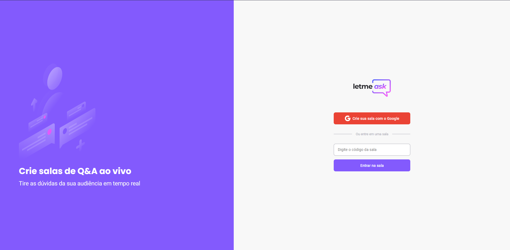

<h1 align="center">
  
</h1>

<p align="center">
  <a href="#-tecnologias">Tecnologias</a>&nbsp;&nbsp;&nbsp;|&nbsp;&nbsp;&nbsp;
  <a href="#-projeto">Projeto</a>&nbsp;&nbsp;&nbsp;|&nbsp;&nbsp;&nbsp;
  <a href="#-como-executar">Como executar</a>&nbsp;&nbsp;&nbsp;|&nbsp;&nbsp;&nbsp;
  <a href="#-licença">Licença</a>
</p>

<p align="center">
  

 
</p>

<br>

<p align="center">
  
</p>

## ✨ Tecnologias

Esse projeto foi desenvolvido com as seguintes tecnologias:

- [React](https://reactjs.org)
- [Firebase](https://firebase.google.com/)
- [TypeScript](https://www.typescriptlang.org/)

## 💻 Projeto

O Letmeask é um projeto desenvolvido para interação entre criadores de conteúdo e seu publico. Através do App, é possível criar uma sala de perguntas ou 
se juntar a uma sala já existente, bastando apenas se logar com sua conta Google. Caso você entre em uma sala, você sera capaz de enviar perguntas e curtir perguntas 
de outros usuários. Do contrário, você irá gerenciar as questões que chegarem em sua sala, podendo marca-las como destacadas, respondidas ou exclui-las.


## 🚀 Como executar

Primeiro faça o download do repositório:
```bash
https://github.com/FischerRobson/letmeask.git
```
Em seguida, instale as dependencias do projeto:
```bash
npm install
# ou
yarn add
```
Inicie o projeto:
```bash
npm run dev
# ou
yarn dev
```
Acesse o link ou <a href="http://localhost:3000/">clique aqui</a>:
```bash
http://localhost:3000/
```

## 📄 Licença

Esse projeto está sob a licença MIT. Veja o arquivo [LICENSE](LICENSE.md) para mais detalhes.

---

Projeto desenvolvido na #NLW/Together da Rocketseat [Participe da nossa comunidade!](https://discordapp.com/invite/gCRAFhc)


